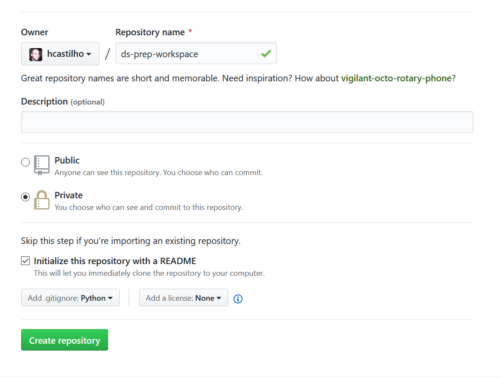
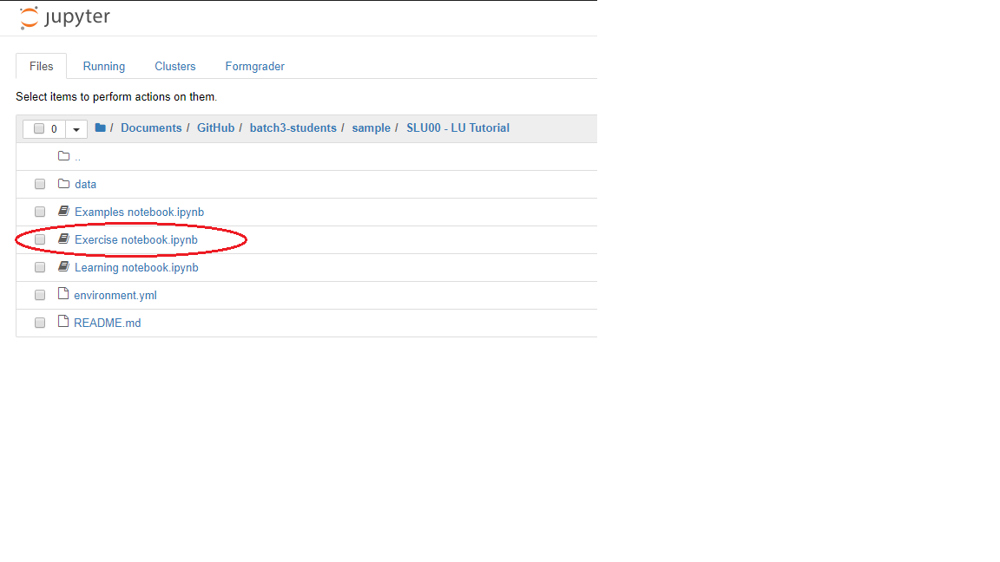

# Batch 3 Students Repository

Welcome to Lisbon Data Science Academy Batch 3 Students repository. The presentation used at the introduction of
the bootcamp is [here](https://docs.google.com/presentation/d/1uMTbu7vRd0tYEp2ksOqRZyLefPEBB_0-pvanLtAOhjk/edit?usp=sharing).

Here is you'll find all information needed to setup your environment and the
workflow you'll use during the academy.

1. [Initial Setup](#initial-setup)
    1. [Setup _Git_/_GitHub_](#setup-_git__github_)
    1. [Install _Anaconda_](#install-_anaconda_)
    1. [Setup your Workspace Repository](#setup-your-workspace-repository)
    1. [Get the Learning Material](#get-the-learning-material)
    1. [Running and Submitting a Learning Unit](#running-and-submitting-a-learning-unit)
1. [Learning Unit Workflow](#learning-unit-workflow)
1. [Updates to Learning Units](#updates-to-learning-units)
1. [Help](#help)
    1. [Learning Unit](#learning-unit-workflow)
    1. [_Portal_](#_portal_)
    1. [Other](#other)

There is also a screencast to accompany this readme. Please note that there is one known issue so far in the screencast
in that the clone of the batch3-students needs to be done by URL (as is shown in this README) and not by filter.

[](https://www.youtube.com/watch?v=6cHRO-ab_L4)

## Initial Setup

**IMPORTANT**
Before the bootcamp you will have to complete these instructions, this is 
essential.

Once you complete the setup mark yourself as such on [this spreadsheet](https://docs.google.com/spreadsheets/d/1bEOwvEmEJONYzW94efixHa8Te8I_QKC91m8WPoADxjY/edit?usp=sharing).

By completing this you will setup and learn about all the tools you'll be
using during the academy.
We will also be able to identify any problems in time to figure out a solution.

### Setup _Git_/_GitHub_

Having a _GitHub_ account and knowing the basics of committing and pushing 
changes are mandatory.
By the end of this setup you will have accomplished both.

1. Install [_git_](https://git-scm.com/)
If you're on Windows or OS X, [_GitHub Desktop_](https://desktop.github.com/) is 
probably easiest.
1. [Sign up](https://github.com/join) for a _GitHub_ account if you don't 
already have one.

If you plan on using the terminal and not _GitHub_ desktop it might be a good
idea to [set up ssh keys](https://help.github.com/articles/connecting-to-github-with-ssh/)
for _GitHub_.

### Install _Anaconda_

The work you will be doing during the academy makes use of packages to provide
extra functionality.
Installing and managing different versions (that may have subtle changes)
in different operating systems and ensuring everyone gets the same results
is a challenging task.
_Anaconda_ is currently the best solution for this problem.

Go to [_Anaconda_](https://www.anaconda.com/distribution/) for installation 
instructions. **BE SURE to choose "Python 3.7 version".**

**If you are on windows**

Make sure that there are no non-english characters in your username or on the 
path and that you have qt installed. [Here is a reference](https://github.com/ContinuumIO/anaconda-issues/issues/1270) 
on how to address these issues.

### Setup your Workspace Repository

It's good practice to store your work with version control. 
In this academy that is a requirement as it is how you will make your work
available to us.

#### Creating the Workspace

1. Log into _GitHub_
1. Create a new **private** _GitHub_ repository called *batch3-workspace*, see 
[Creating a new repository](https://help.github.com/en/articles/creating-a-new-repository). 
**IMPORTANT** The repo **MUST** be named *batch3-workspace*! 
If you name it anything else, you will be unable to submit any of your work!
    1. You need to explicitly select Private - This is your work and nobody else's. 
    You will be graded based upon the merits of what you are able to do here 
    so this should not be open to the world while you are working
    on it. 
    Maybe after the course is completed, you can open-source it but not this 
    time.
    1. Initialize with a README. 
    This is mostly just so that you don't initialize an empty repo.
    1. Add a Python `.gitignore`.
    This step is insanely important. If you don't do this, you may
    end up checking things into the repo that make it un-gradeable by our 
    grading system.
    ADD THE `.gitignore` PLEASE!!!! <--- 4 * `!` isn't enough



#### Add a Deploy Key to your Repository

Since the repository is private you will have to explicitly give access so
that our grading system can fetch the repository.
To do this you will be adding a deploy key to the repository, which we
provide to you in our [_Portal_](https://portal.lisbondatascience.org/).

1. Head on to the [_Portal_](https://portal.lisbondatascience.org/)
1. Log in with your _GitHub_ account
1. Go to your [profile](https://portal.lisbondatascience.org/users/info/) and 
copy the deploy key

1. Go back to the repository you have just created
1. Go back to the repository you have just created
1. Go to `Settings > Deploy Keys`
1. Click "Add deploy key"
1. Give it a recognizable name like "grader" and paste the key from the 
_Portal_


#### Cloning the Workspace

###### Using _GitHub Desktop_

1. Click "Clone a repository from the internet..." or select 
"File > Clone repository" on the menubar if this not your first time


1. Filter by "batch3-workspace"

1. Select and clone

###### Using the terminal

1. Open a Terminal or Git Bash, the next steps are on this terminal
1. Clone your _<username>/batch3-workspace_ repository
```bash
git clone https://github.com/<username>/batch3-workspace.git
```

Or if you have your ssh keys set up:
```bash
git clone git@github.com:<username>/batch3-workspace.git
```

### Get the Learning Material

You will be cloning the [batch3-students](https://github.com/LDSSA/batch3-students) 
repository.
All of the learning material you need will be made available on this repo
as the academy progresses.

###### Using _GitHub Desktop_

1. Select "File > Clone repository" on the menubar

1. Select by URL "ldssa/batch3-students"

1. Select and press clone

###### Using the terminal

1. Open a Terminal or Git Bash, the next steps are on this terminal
1. Clone the students repository 
[batch3-students](https://github.com/LDSSA/batch3-students)
```bash
git clone https://github.com/LDSSA/batch3-students.git
```
Or if you have your ssh keys set up:

```bash
git clone git@github.com:LDSSA/batch3-students.git
```

### Running and Submitting a Learning Unit

In the `batch3-students` repository that you just cloned there is a sample
learning unit.
It's used to give instructors guidelines to produce the learning units.
We are also using it to ensure that you are able to run and submit a learning 
unit.

So go ahead and copy the sample directory `sample/SLU00 - LU Tutorial` from the `
batch3-students` repository to your repository (named `batch3-workspace`).


The grader only requires you to have the contents in a directory starting with
the learning unit's ID, but we highly advise to keep the same directory 
structure as the students repository.
All learning units are organized as: 
```
<specialization ID> - <specialization name>/<learning unit ID> - <learnin unit name>
```
Doing so will help you keep organized and ease copying data from the students
repository to yours.

#### Creating a Conda Environment

With each learning unit you will be provided with an `environment.yml` file.
It tells _Anaconda_ all the packages the learning unit depends on and it
will be used to create an _Anaconda_ environment.

An environment is simply an isolated set of packages. 
When you run your code inside an environment you will have access to the 
same version of the packages the instructor used to create the notebooks.

###### Using the Graphical Interface

1. Select "Environments"
1. Select "Import"

1. Set `slu00` for the name and select the `environment.yml` file in the 
learning unit directory (the one in your `batch3-workspace`).


###### Using the Terminal

```bash
cd batch3-workspace/sample/SLU00\ -\ LU\ Tutorial
conda env create -n slu00 --file environment.yml
```

#### Working on the Learning Unit

All learning units come as a set of Jupyter Notebooks (and some links to
presentations).
Notebooks are documents that can contain text, images and live code that you
can run interactively.

In this section we will launch the Jupyter Notebook application.
The application is accessed through the web browser.

Once you have the application open feel free to explore the sample learning
unit structure.
It will give you a handle on what to expect and what rules the instructors
follow (and the effort they put) when creating a learning unit.

So let's start the Jupyter Notebook app.

###### Using the Graphical Interface

1. Click the play button next to the newly created environment and select
"Open with Jupyter Notebook"


###### Using the Terminal

1. Activate the environment and run jupyter notebook
```bash
conda activate slu00
jupyter notebook
```

##### The Exercise Notebook

Every learning unit contains an exercise notebook with exercises you will
work on.
So let's have a look at the sample Learning Unit. 
1. On the Jupyter Notebook UI in the browser open the exercise notebook

1. Follow the instructions provided in the notebook

Besides the exercises and the cells for you to write solutions you will see
other cells with a series of `assert` statements.
This is how we (and you) will determine if a solution is correct.
If all `assert` statements pass, meaning you dont get an `AssertionError` or
any other kind of exception, the solution is correct.

Once you've solved all of the notebook we recommend the following this simple 
checklist to avoid unexpected surprises.
1. Save the notebook (again)
1. Run "Restart & Run All"

1. At this point the notebook should have run without any failing assertions

If you want to submit your notebook before it is all the way done to
check intermediate progress, feel free to.

If you are able to go through the entire process and get a passing grade on 
the sample LU you'll have a good understanding of the same flow that you'll use
for all LUs throughout the academy.

#### Commit and Push

Now you have worked on the sample learning unit and you have some uncommitted 
changes.
It's time to commit the changes, which just means adding them to your `batch3-workspace`
repository history, and pushing this history to you remote on _GitHub_.

###### Using _GitHub Desktop_

1. Use the _GitHub Desktop_ application commit the changes and push


###### Using the terminal

1. Using the terminal commit and push the changes
```bash
git add .
git commit -m 'Testing the sample notebook'
git push
```

##### Some Advice

Our advice it to get comfortable with _git_, commit often and create branches 
to try different solutions and once you're ready merge everything back to
the `master` branch.
Having all of the iterations will help you keep track of your work.

Here is a recommendation for a _git_ workflow, if you are not comfortable you
don't need to use it (but using it _will_ make you comfortable).
1. Create a branch for the learning unit you're working on e.g. `slu00`
1. Copy the files and commit
1. Work a bit and commit, start the commit message with WIP (work in progress)
1. Once you are ready checkout the `master` branch and merge the `slu00` branch
into it
1. Push the changes

#### Grading

1. Go to the [_Portal_](https://portal.lisbondatascience.org) and select the learning unit

1. Select "Grade"

1. After grading is complete you should have 20/20 
1. If everything passes locally but the grader doesn't give you the excepted 
output head to out [troubleshooting](#_portal_)
1. Once you have your grade don't forget to do the 
[spreadsheet](https://docs.google.com/spreadsheets/d/1bEOwvEmEJONYzW94efixHa8Te8I_QKC91m8WPoADxjY/edit?usp=sharing) thing.

## Learning Unit Workflow

Learning units will be announced in the academy's _#annoucements_ channel.
At this point they are available in the 
[batch3-students](https://github.com/LDSSA/batch3-students) 
repository and submissions are open in the 
[_Portal_](https://portal.lisbondatascience.org).

The steps you followed during the initial setup are exactly what you are going
to be doing for each new learning unit.
Here's a quick recap:
1. Once a new learning unit is available pull the changes from the 
[batch3-students](https://github.com/LDSSA/batch3-students) repo.
1. Copy the unit to your `batch3-workspace` repo
1. Work
1. Once all tests pass or once you're happy, commit the changes and push
1. Go to the [_Portal_](https://portal.lisbondatascience.org), select the learning unit you're working on and click  "Grade"
1. Refresh the page until you get the results back
1. Profit

## Updates to Learning Units

As much as we try and have processes in place to prevent errors and bugs in 
the learning units some make it through to you.
If the problem is not in the exercise notebook you can just pull the new 
version from the students repo and replace the file.
The problem is if the correction is in the exercise notebook, you can't just
replace the file your work is there and you'll lose it!

When a new version of the exercise notebook is released (and announced) two
things will happen.
If you submit an old version of the notebook it will be flagged as out of date
and not graded.
You will have to merge the work you've already done into the new version of the
notebook.

At the moment our suggestion to merge the changes is: 
1. Rename the old version
1. Copy the new exercise notebook over
1. Open both and copy paste your solutions to the new notebook

We understand it's not ideal and are working on improving this workflow using
[_nbdime_](https://nbdime.readthedocs.io/).
If you are comfortable installing _Python_ packages you can try it out, but
we offer no support for this at the moment.

## Help

During the academy you will surely run into problems and have doubts about the
material.
We provide you with some different channels to ask for help.

### Learning Unit

If you feel something is not clear enough or there is a bug in the learning
material please follow [these steps](https://github.com/LDSSA/wiki/wiki/How-to-ask-for-and-give-help). Remember, there is no such thing as a dumb question, and by asking questions publically you will help others! 

If you have more conceptual questions about the materials or how to approach a problem you can also
reach out to the instructors on slack.
You can find the main contact for the learning unit in the
[_Portal_](https://portal.lisbondatascience.org/) this instructor can help you
out or redirect you to someone that is available at the moment.

### _Portal_

Are you getting different results locally than what you are getting in the 
_Portal_?
If so we will first ask to do a bit of troubleshooting.
1. Ensure that you have saved the changes in the notebook
1. Ensure that you have committed and pushed the changes
1. Ensure that you are not using packages that are not present in the original
`environment.yml` file (changes to this file or your local environment have no
effect)
1. In the learning unit page in the [_Portal_](https://portal.lisbondatascience.org/)
you are able to download the exercise notebook with the results of the grader
by clicking your grade, have a look to figure out what went wrong.

If none of these steps helped go ahead and open a support ticket for the portal
[here](https://github.com/LDSSA/batch3-portal-support).

Is the _Portal_ down or acting out in some unexpected way?
Then please open a support ticket for the portal
[here](https://github.com/LDSSA/batch3-portal-support).

### Other

If your problem doesn't fit in any  of the previous categories head over to
slack and ask.
Someone will surely point you in the right direction.

If you're looking for some specific part of our organization head over to the
[Member Directory](https://github.com/LDSSA/wiki/wiki/Member-Directory)
and search for the area of responsibility you're looking for.

